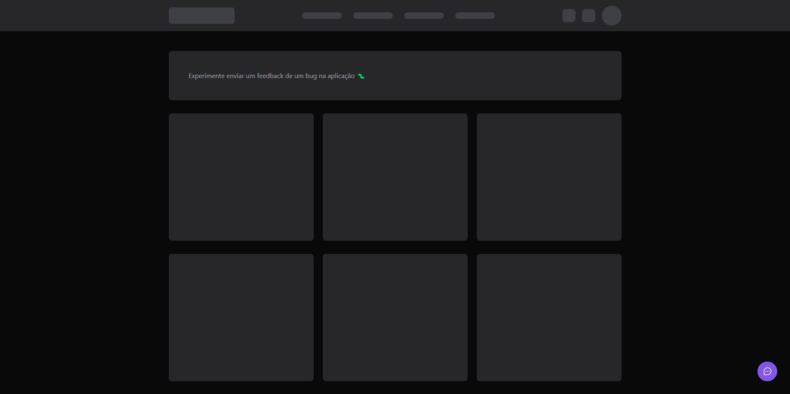
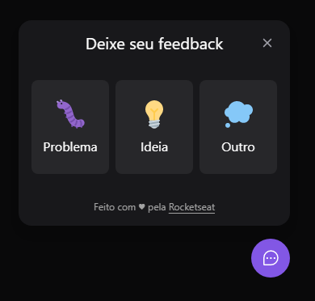
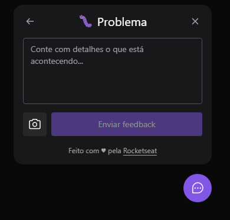
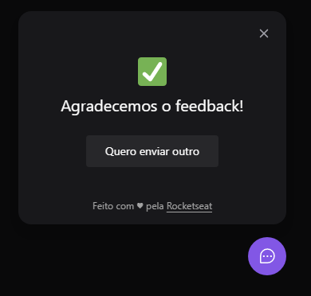

<h1 align="center">NLW Return web app</h1>

 |  | 

## Bem vindo!

Esse projeto foi desenvolvido durante a NLW Return da [Rocketseat](https://www.rocketseat.com.br/)

## O projeto

O projeto consiste de um botão de feedbacks, onde o usuário consegue reportar um bug, dar uma sugestão ou apenas mandar uma mensagem, podendo conter ou não uma screenshot da página, para o responsável pela plataforma. 

## Links

- Live Site: [Widget](https://widgetnlw.vercel.app/)
- Rocketseat: [Rocketseat](https://www.rocketseat.com.br/)

## Libs usadas

- [React](https://reactjs.org/) - Biblioteca JS
- [Tailwind](https://tailwindcss.com/) - CSS Framework 
- [Phosphor Icons](https://phosphoricons.com/) - Coleção de ícones
- [Headless UI](https://headlessui.dev/) - UI components que integram com o Tailwind
- [HTML2Canvas](https://html2canvas.hertzen.com/) - Screenshots com o Javascript

## Autor

- Linkedin - [Navar Kartalian](https://www.linkedin.com/in/navar-kartalian-784637206/)